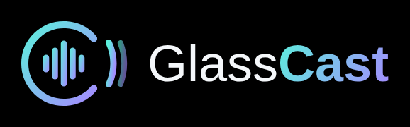

# GlassCast

A sleek, streaming-only podcast player built for **Meta Ray-Ban Display** glasses.
Plain HTML/CSS/JS — no build step, no accounts, no API keys.



## Features

- **Search** the Apple Podcasts directory by name, host or topic. Speak or write into the box; once the glasses' text panel puts your words in, GlassCast searches straight away and moves the highlight onto the results. The labelled **Search** button glows when it's highlighted.
- **Add by RSS feed:** type or paste a feed address (e.g. a private Patreon feed) into Search and GlassCast reads the feed directly, including its episodes and artwork.
- **On-screen keyboard** (the ⌨ button) for typing feed addresses, with shortcut keys for `https://`, `www.`, `.com`, `.xml` and URL symbols, plus a caps toggle for case-sensitive feed links.
- **Add / remove** shows with the `+` button beside each result, or from the show page. To remove a show, use the bin icon at the right of its Library row (or **In Library** on its page): the first press asks *Remove?*, a second press confirms, and moving away cancels.
- **Clear (×)** inside the search box empties it in one press. The glasses' text panel adds to whatever is already in the box, so clear it before a new search. If a feed address ends up stuck on the end of old text, GlassCast still finds it.
- **Library** home screen, sorted by most recent episode, with a **“N new”** badge per show.
- **Continue listening** card — picks up exactly where you left off.
- **Episodes stay lit until heard.** Unplayed episodes are bright with a glowing dot; heard ones are greyed out, labelled *Played*, and still playable. Half-finished ones show a progress bar and time left.
- **Mark played / unplayed** per episode (the ✓ on the right of each row), plus **Mark all played** for catching up on a new show.
- **Player:** back to start · −15s · play/pause · +30s · skip to end (marks it played), podcast name, and the episode title, which waits and then scrolls slowly **once** if it's too long.
- **Playback speed** (1× → 1.25× → 1.5× → 1.75× → 2× → 0.8×), remembered between sessions.
- **Now-playing pill** pinned to the top of every screen while an episode is loaded. Select it to open the player, or use the button beside it to play/pause.
- **Back** button top-left on every screen, and the glasses' own Back gesture works too.
- **Battery saver:** after 10 seconds without input the display dims to a faint glow; 5 seconds later it goes fully dark (black pixels are unlit on the glasses). The episode keeps playing throughout. **Only Select (pinch / tap) or Back wakes it.** Swipes and stray hand movement are ignored while it's asleep, and the waking press never presses a button. To change the timings, add `?idle=30,20` to the app's address (seconds to dim, then seconds to dark; `0` turns it off).

## Put it on GitHub Pages

1. Create a new public repo (e.g. `glasscast`) and upload **everything in this folder**, including the hidden `.well-known` folder and the `.nojekyll` file.
   - macOS Finder hides dot-files. Press **Cmd + Shift + .** to show them before dragging, or in GitHub use **Add file → Create new file**, type `.well-known/meta-wearables-manifest.json` as the name and paste the contents in.
2. Repo **Settings → Pages →** Source: *Deploy from a branch*, Branch: `main` / `(root)` → Save.
3. After a minute your app is live at `https://<your-username>.github.io/glasscast/`.
4. Check `https://<your-username>.github.io/glasscast/.well-known/meta-wearables-manifest.json` loads (if it 404s, `.nojekyll` is missing).

## Add it to your glasses

In the **Meta AI app** (Developer Mode on): **App Settings → Apps → Web Apps → Connect Web App**, paste your HTTPS URL, **Save**. GlassCast appears at the bottom of your app grid with its own icon.

## Controls

| On the glasses | Does |
|---|---|
| Swipe / arrows | Move between buttons |
| Pinch / tap (Enter) | Select |
| Back gesture | Previous screen |

GlassCast moves the highlight itself, so it can reach items scrolled out of view, like long episode lists. At the top of a list, Up goes to the header and then to the now-playing pill, and Left jumps to Back. Testing in desktop Chrome: arrow keys and Enter work the same, and `Esc` is Back.

## Files

```
index.html                           app shell
styles.css                           look & feel (black = see-through on the glasses)
app.js                               everything else
icons/                               logo, favicons, monochrome launcher icon
.well-known/meta-wearables-manifest.json   name + icon for the glasses' app grid
.nojekyll                            lets GitHub Pages serve .well-known
```

## Notes

- **Artwork comes from each podcast's own RSS feed** (its `<itunes:image>` / `<image>` cover), so it always matches what the show itself publishes. GlassCast reads only the top of the feed (it stops before the first episode), caches the result for a week, and fills the image in as soon as it's found.
- Some feed hosts don't let web apps read their feeds directly. When that happens GlassCast reads the feed through a public relay (allorigins.win, then codetabs.com). If a feed still can't be reached, it falls back to Apple's copy of the cover so nothing is left blank.
- **Feed errors** say what went wrong: a wrong address (404), a refused or expired key (401/403), a web page instead of a feed, or a timeout. Patreon lets GlassCast read its feeds directly, so private Patreon links don't need the relay.
- **Private feeds:** if a feed's host blocks direct reading, its address is sent through the public relay. For a private feed (like Patreon) that address includes your personal access key, so the relay service can see it.
- Show search and episode lists come from Apple's public iTunes Search/Lookup API, which returns up to the **200 most recent** episodes per show.
- Your library, played marks and positions live in the glasses' browser storage for this site. Removing the web app or clearing data resets them.
- Audio streams straight from each podcast's host; nothing is downloaded.
- Meta's docs don't cover background audio, so assume playback stops when you leave the app. Your position is saved every few seconds, so *Continue listening* picks it back up.
